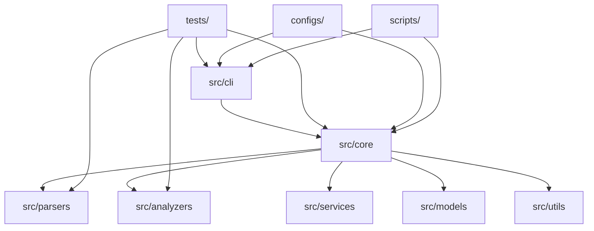
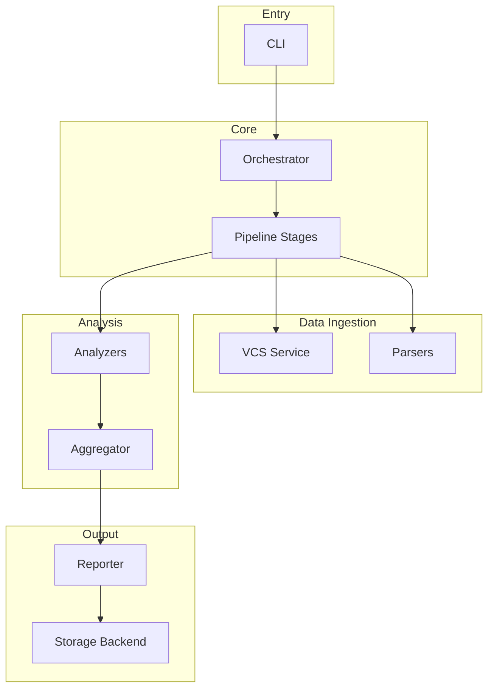
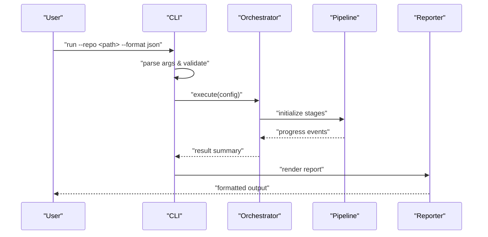
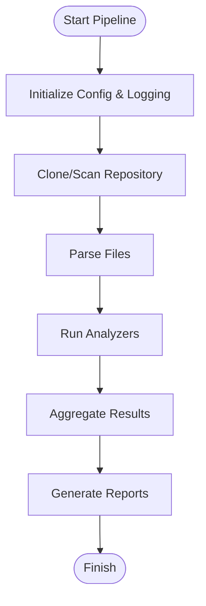
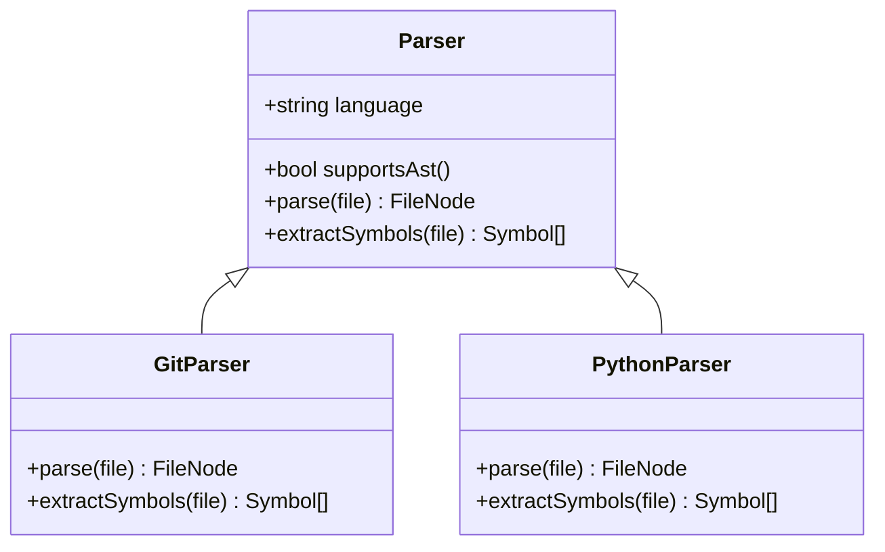
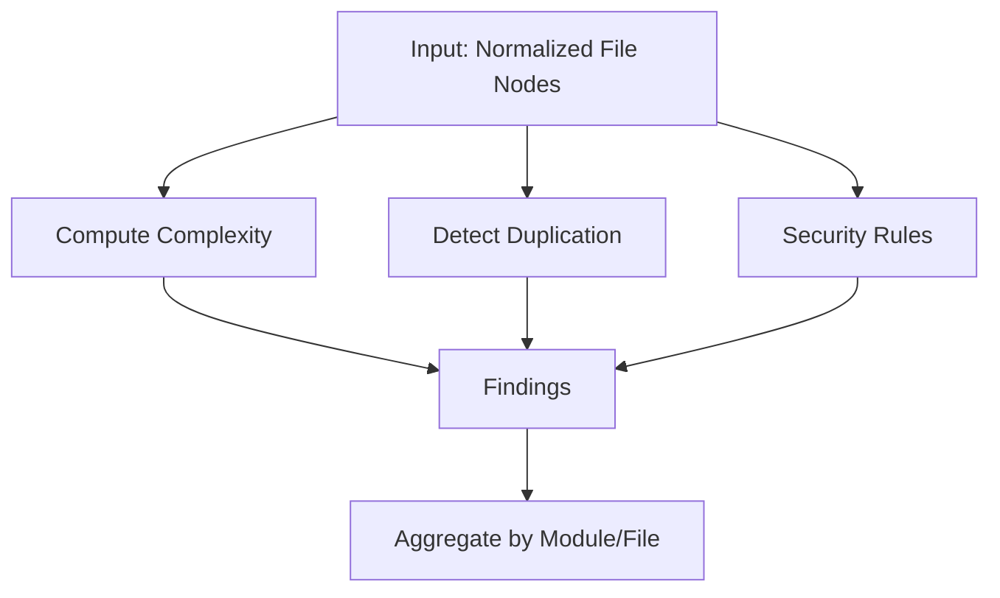
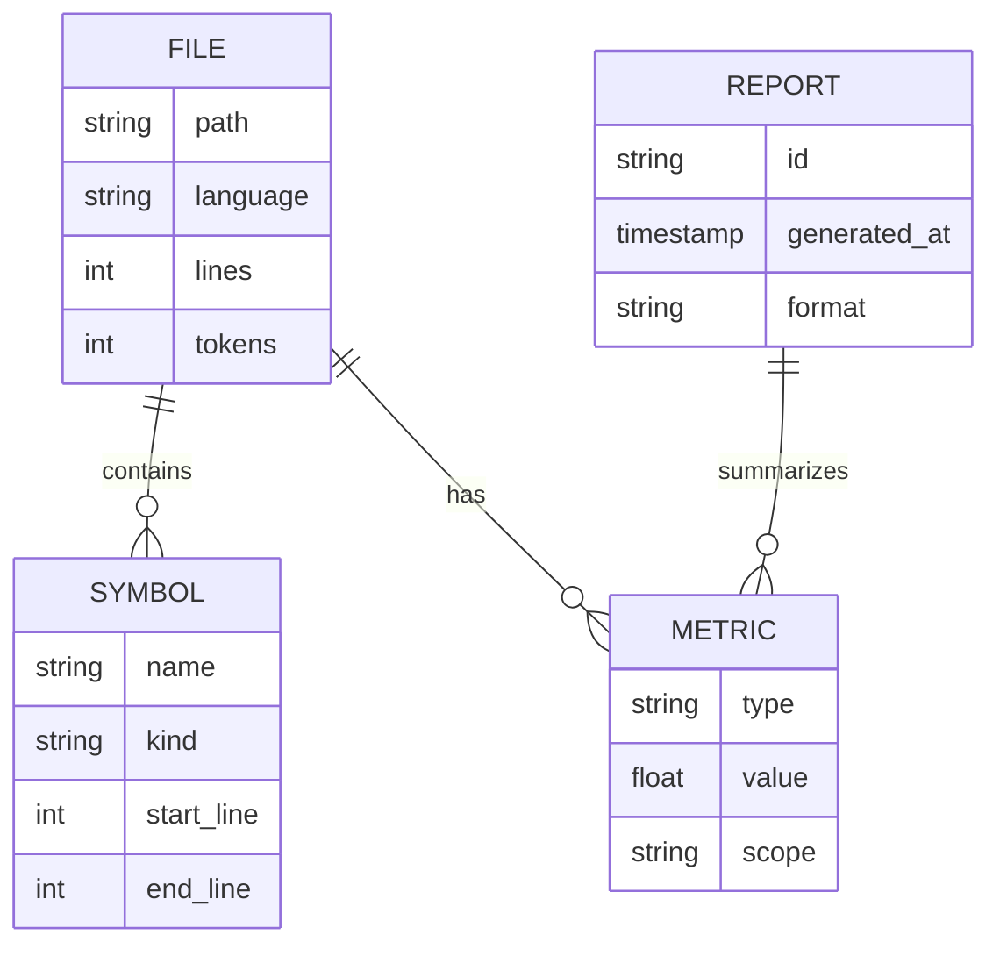
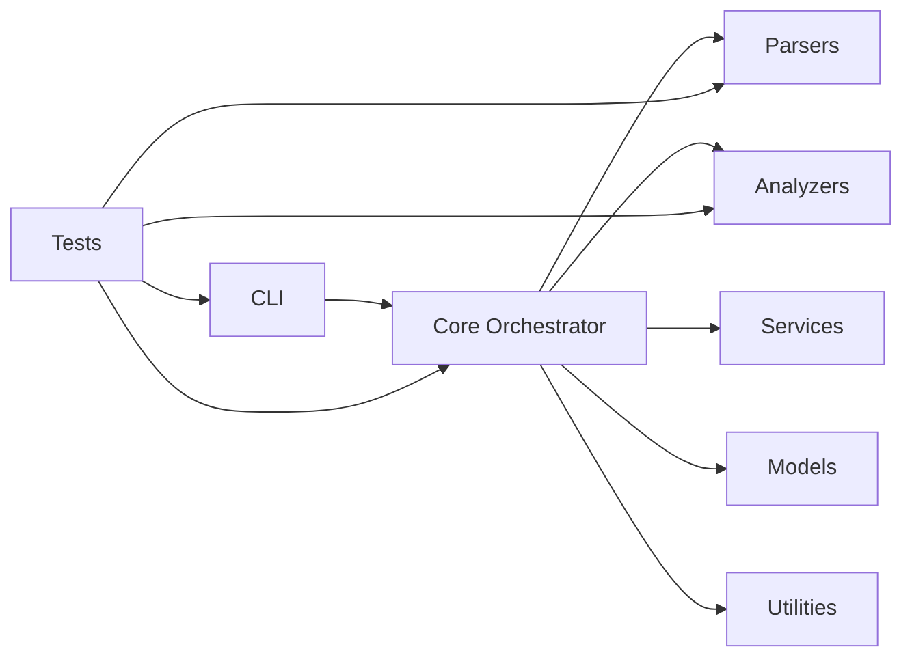

# Development Guidelines

<cite>
**Referenced Files in This Document**
- [README.md](file://README.md)
- [.gitignore](file://.gitignore)
</cite>

## Table of Contents
1. [Introduction](#introduction)
2. [Project Structure](#project-structure)
3. [Core Components](#core-components)
4. [Architecture Overview](#architecture-overview)
5. [Detailed Component Analysis](#detailed-component-analysis)
6. [Dependency Analysis](#dependency-analysis)
7. [Performance Considerations](#performance-considerations)
8. [Troubleshooting Guide](#troubleshooting-guide)
9. [Conclusion](#conclusion)
10. [Appendices](#appendices)

## Introduction
This document establishes development guidelines for the Repo-Analysis-Tool, a repository analysis tool focused on ingesting codebases, extracting metrics, and producing actionable insights. It defines coding standards, recommended project structure, architectural patterns, testing strategies, and performance best practices tailored to large repositories. The guidance is designed to be language-agnostic while providing concrete examples of file organization, naming conventions, and documentation standards.

The repository currently contains minimal scaffolding; these guidelines provide a forward-looking blueprint for growing the codebase into a robust, maintainable system.

**Section sources**
- [README.md:1-3](file://README.md#L1-L3)

## Project Structure
Recommended top-level layout for a scalable repository analysis tool:

- src/
  - cli/ — Command-line interface entry points and argument parsing
  - core/ — Core orchestration, pipeline stages, and shared abstractions
  - parsers/ — Language-specific parsers and AST builders
  - analyzers/ — Metric extraction and analysis logic
  - models/ — Shared data structures (metrics, results, config)
  - services/ — External integrations (e.g., VCS providers, storage backends)
  - utils/ — Cross-cutting utilities (logging, IO helpers, concurrency)
  - tests/ — Unit, integration, and end-to-end tests mirroring src/ structure
- docs/ — Developer and user documentation
- scripts/ — Automation (linting, formatting, CI helpers)
- configs/ — Linting, formatting, and build configuration files
- .github/workflows/ — CI pipelines
- README.md — Project overview and quickstart
- .gitignore — Generated/runtime artifacts exclusion

Guidelines:
- Feature-based grouping within modules (e.g., parsers/gitlab, analyzers/cyclomatic).
- Keep CLI thin; delegate business logic to core and services.
- Use clear module boundaries with explicit interfaces/contracts.
- Mirror test directories under tests/ to match source layout.

[No sources needed since this diagram shows conceptual structure]

**Section sources**
- [.gitignore:1-150](file://.gitignore#L1-L150)

## Core Components
Key components and responsibilities:

- CLI Layer
  - Parses arguments, validates inputs, invokes orchestrator, formats output.
- Core Orchestrator
  - Coordinates pipeline stages: clone/scan, parse, analyze, aggregate, report.
  - Manages configuration, logging, progress reporting, and error propagation.
- Parsers
  - Language-specific ingestion (AST or tokenization), normalization, and metadata extraction.
- Analyzers
  - Metrics computation (complexity, duplication, coverage, security signals).
  - Rule engines and policy checks.
- Models
  - Canonical representations for files, symbols, metrics, and reports.
- Services
  - Repository access (Git, remote APIs), storage backends, caching layers.
- Utilities
  - Concurrency control, streaming IO, logging, serialization, validation.

Responsibility boundaries:
- Parsers should not contain analysis logic.
- Analyzers should remain parser-agnostic via normalized models.
- Services encapsulate external dependencies and retries/backoff.

**Section sources**
- [.gitignore:1-150](file://.gitignore#L1-L150)

## Architecture Overview
Recommended layered architecture with a processing pipeline:

**Diagram sources**
- [.gitignore:1-150](file://.gitignore#L1-L150)

## Detailed Component Analysis

### CLI Layer
- Responsibilities:
  - Argument parsing, environment configuration, logging setup.
  - Invoking orchestrator and handling exit codes.
- Recommendations:
  - Validate all inputs early; surface user-friendly errors.
  - Support structured logs and machine-readable outputs.
  - Provide flags for parallelism, memory limits, and incremental runs.

[No sources needed since this diagram shows conceptual workflow]

**Section sources**
- [.gitignore:1-150](file://.gitignore#L1-L150)

### Core Orchestrator and Pipeline
- Responsibilities:
  - Stage lifecycle management, dependency ordering, error handling, and cancellation.
  - Progress tracking, telemetry, and resource accounting.
- Recommendations:
  - Implement a stage interface with standardized hooks (init, process, finalize).
  - Use backpressure-aware streams for large repos.
  - Provide retry policies for flaky operations (network, disk IO).

[No sources needed since this diagram shows conceptual workflow]

**Section sources**
- [.gitignore:1-150](file://.gitignore#L1-L150)

### Parsers
- Responsibilities:
  - Language-specific parsing, AST construction, symbol extraction, and metadata normalization.
- Recommendations:
  - Define a common parser contract (language, supported extensions, capabilities).
  - Cache parsed trees where feasible; avoid re-parsing unchanged files.
  - Stream file contents to reduce memory pressure.

[No sources needed since this diagram shows conceptual classes]

**Section sources**
- [.gitignore:1-150](file://.gitignore#L1-L150)

### Analyzers
- Responsibilities:
  - Compute metrics (cyclomatic complexity, duplication, coverage, security rules).
  - Apply configurable rules and thresholds.
- Recommendations:
  - Keep analyzers stateless where possible; pass context objects.
  - Allow pluggable rule sets and custom analyzer registration.
  - Emit structured findings with severity and location metadata.

[No sources needed since this diagram shows conceptual workflow]

**Section sources**
- [.gitignore:1-150](file://.gitignore#L1-L150)

### Models
- Responsibilities:
  - Canonical types for files, symbols, metrics, and reports.
- Recommendations:
  - Versioned schemas for evolving metrics.
  - Immutable data structures for thread safety.
  - Validation at boundaries (input/output).

[No sources needed since this diagram shows conceptual schema]

**Section sources**
- [.gitignore:1-150](file://.gitignore#L1-L150)

### Services
- Responsibilities:
  - Repository access (local paths, Git remotes), authentication, rate limiting.
  - Storage backends (filesystem, object storage), caching, and indexing.
- Recommendations:
  - Abstract provider interfaces; swap implementations per environment.
  - Implement exponential backoff and circuit breakers for external calls.
  - Log operational metrics without sensitive data.

**Section sources**
- [.gitignore:1-150](file://.gitignore#L1-L150)

### Utilities
- Responsibilities:
  - Logging, concurrency primitives, IO helpers, serialization, validation.
- Recommendations:
  - Centralize logger configuration; support structured JSON logs.
  - Provide safe wrappers around filesystem/network operations.
  - Expose reusable concurrency controls (workers, queues, rate limiters).

**Section sources**
- [.gitignore:1-150](file://.gitignore#L1-L150)

## Dependency Analysis
Principles:
- Minimize coupling between parsers and analyzers through normalized models.
- Keep CLI decoupled from analysis logic.
- External dependencies should be abstracted behind service interfaces.

[No sources needed since this diagram shows conceptual relationships]

**Section sources**
- [.gitignore:1-150](file://.gitignore#L1-L150)

## Performance Considerations
- Streaming and Backpressure
  - Process files as streams; avoid loading entire repositories into memory.
  - Use bounded buffers and backpressure-aware queues.
- Parallelism
  - Configure worker pools based on CPU cores; throttle I/O-bound tasks separately.
  - Avoid oversubscription; monitor queue depths and latency.
- Caching and Incremental Runs
  - Cache parsed ASTs and intermediate metrics keyed by content hashes.
  - Support incremental scans using change detection (e.g., git diff).
- Memory Management
  - Explicitly release references after processing; prefer generators/iterators.
  - Monitor RSS and GC pauses; tune buffer sizes accordingly.
- Disk and Network I/O
  - Batch writes; use buffered writers and temporary files for large outputs.
  - Respect rate limits and implement retries with jitter.
- Profiling and Telemetry
  - Instrument key stages with timing and throughput metrics.
  - Export metrics to observability systems; avoid high-cardinality labels.

[No sources needed since this section provides general guidance]

## Troubleshooting Guide
Common issues and resolutions:
- Out-of-memory during analysis
  - Reduce parallelism, enable streaming, increase chunk sizes cautiously.
  - Profile heap usage; identify retained references.
- Slow parsing on large repos
  - Enable incremental mode; cache ASTs; exclude irrelevant paths.
- Flaky network operations
  - Implement retries with exponential backoff; verify credentials and proxies.
- Incorrect metrics
  - Validate input normalization; ensure consistent language detection.
  - Add unit tests for edge cases (empty files, binary blobs).

Operational tips:
- Use structured logs with correlation IDs across stages.
- Capture snapshots of failing states (without secrets) for debugging.
- Maintain runbooks for known failure modes.

**Section sources**
- [.gitignore:1-150](file://.gitignore#L1-L150)

## Conclusion
These guidelines define a scalable, maintainable architecture for the Repo-Analysis-Tool. By adhering to the recommended structure, patterns, and performance practices, teams can deliver reliable analysis features that handle diverse repository types and scale to large codebases. Continuous testing, clear contracts, and strong separation of concerns will keep the system robust as it evolves.

[No sources needed since this section summarizes without analyzing specific files]

## Appendices

### Coding Standards
- Naming
  - Modules: lowercase_with_underscores
  - Classes/Types: PascalCase
  - Functions/Methods: camelCase or snake_case consistently per language
  - Constants: UPPER_SNAKE_CASE
- Documentation
  - Public APIs must include concise docstrings/comments describing purpose, parameters, return values, and exceptions.
  - Maintain a CHANGELOG and versioned schemas for models.
- Error Handling
  - Fail fast with descriptive messages; wrap low-level errors with domain-specific exceptions.
  - Never swallow exceptions; log and propagate context.
- Configuration
  - Externalize settings via typed config objects; validate defaults and environment variables.
- Security
  - Sanitize inputs; never log secrets; rotate credentials regularly.

[No sources needed since this section provides general guidance]

### Testing Strategies
- Unit Tests
  - Isolate analyzers and parsers with mocks/stubs; assert on normalized models.
- Integration Tests
  - Spin up local Git repos and run full pipeline against sample datasets.
- Property-Based Tests
  - Generate random code snippets to validate parser robustness and metric stability.
- Performance Tests
  - Benchmark parsing and analysis on representative large repos; track regressions.
- Test Data
  - Maintain curated fixtures covering multiple languages and edge cases.

[No sources needed since this section provides general guidance]

### File Organization and Naming Examples
- src/parsers/javascript/index.ts
- src/analyzers/cyclomatic_complexity.ts
- src/models/file.ts
- src/services/vcs/git_service.ts
- tests/unit/analyzers/cyclomatic_complexity.test.ts
- tests/fixtures/sample_repos/js_project

[No sources needed since this section provides general guidance]

### Documentation Standards
- README
  - Purpose, quickstart, architecture overview, and links to detailed docs.
- API Docs
  - Auto-generated where possible; include examples and error codes.
- Runbooks
  - Operational procedures for deployment, scaling, and incident response.

[No sources needed since this section provides general guidance]