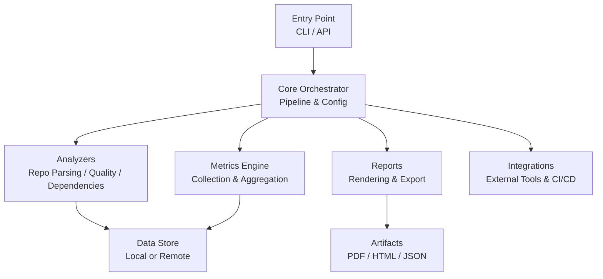
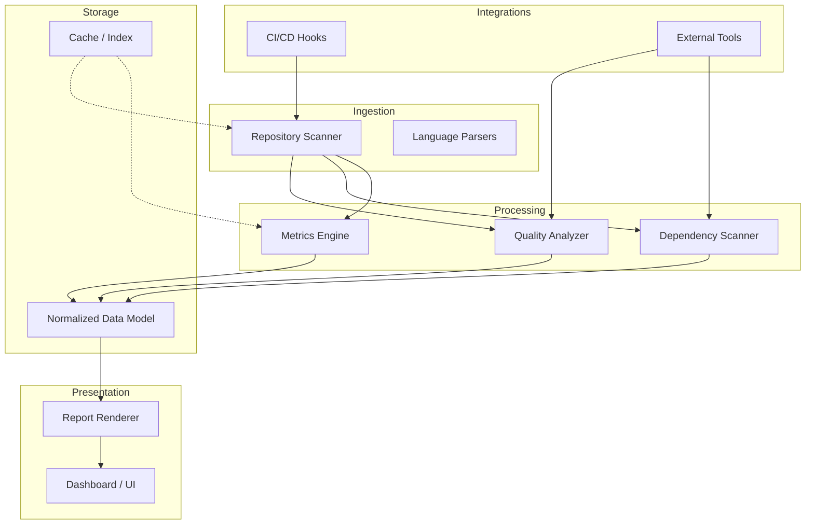
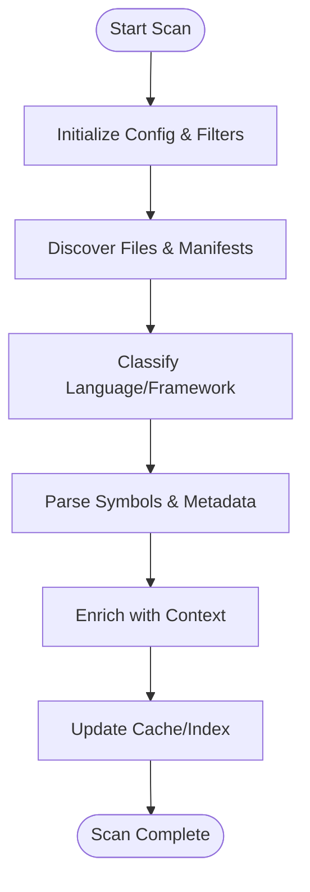
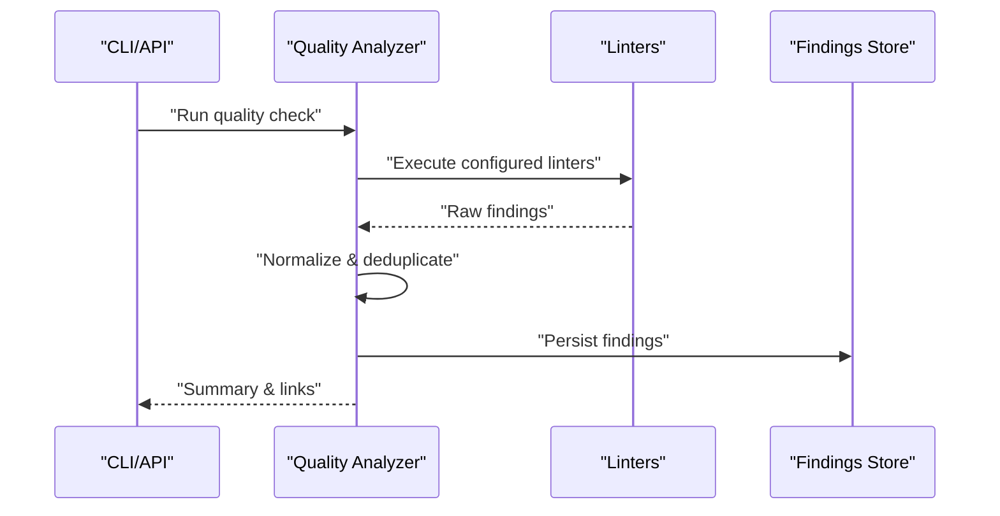
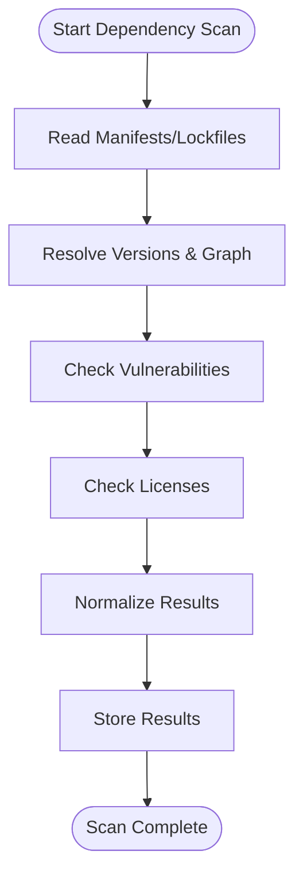
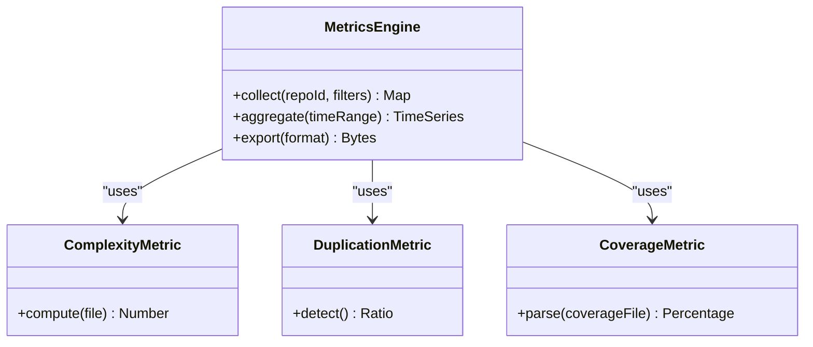
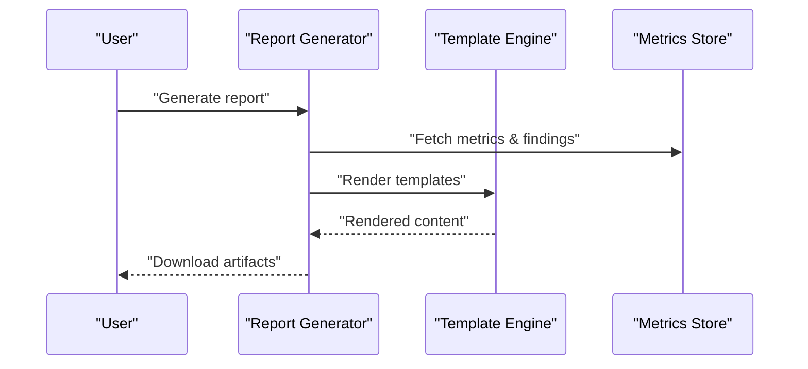
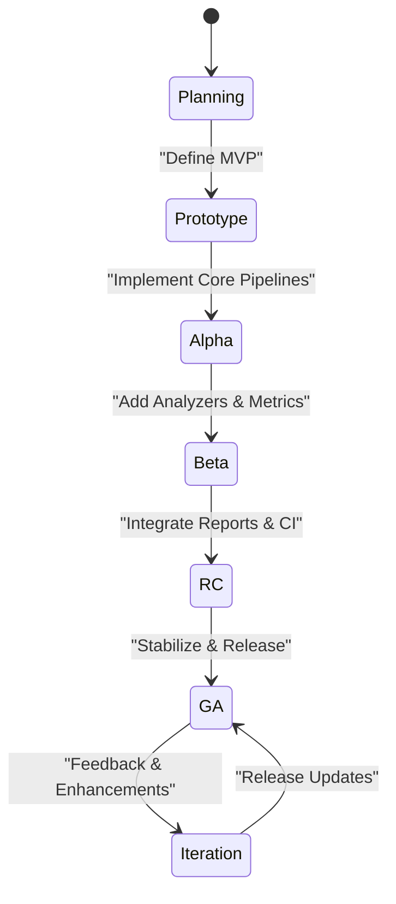
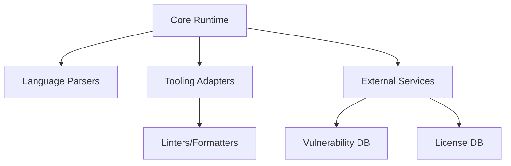

# Future Implementation Roadmap

<cite>
**Referenced Files in This Document**
- [README.md](file://README.md)
</cite>

## Table of Contents
1. [Introduction](#introduction)
2. [Project Structure](#project-structure)
3. [Core Components](#core-components)
4. [Architecture Overview](#architecture-overview)
5. [Detailed Component Analysis](#detailed-component-analysis)
6. [Dependency Analysis](#dependency-analysis)
7. [Performance Considerations](#performance-considerations)
8. [Troubleshooting Guide](#troubleshooting-guide)
9. [Conclusion](#conclusion)
10. [Appendices](#appendices)

## Introduction
This document defines a comprehensive future implementation roadmap for the Repo-Analysis-Tool, aligned with the SDP Test 2026 context. It outlines expected capabilities across repository analysis, code quality assessment, dependency management, metrics collection, and report generation. It also provides architectural guidance, technology stack recommendations, milestone definitions, feature prioritization, development phases, integration points, and contributor guidelines to ensure consistent, high-quality evolution of the project.

The project’s current scope is minimal; this roadmap establishes a forward-looking plan to grow into a robust, extensible platform for analyzing software repositories at scale.

[No sources needed since this section summarizes without analyzing specific files]

## Project Structure
At present, the repository contains only a README file. The roadmap proposes a modular structure that separates concerns by capability (analysis engines, metrics, reporting, integrations), while maintaining a clear entry point and configuration layer.

Proposed top-level layout:
- src/
  - core/ (orchestration, pipeline, config)
  - analyzers/ (repository parsing, code quality, dependency scanning)
  - metrics/ (collection, aggregation, storage)
  - reports/ (rendering, export formats)
  - integrations/ (external tools, CI/CD hooks)
- tests/
- docs/
- scripts/
- configs/

[No sources needed since this diagram shows conceptual workflow, not actual code structure]

**Section sources**
- [README.md:1-3](file://README.md#L1-L3)

## Core Components
The roadmap identifies five primary components that will underpin the tool’s functionality:

- Repository Analyzer
  - Parses source trees, detects languages, extracts symbols, and builds an internal representation.
  - Supports incremental scans and caching for performance.
- Code Quality Assessor
  - Applies linters, static analyzers, and custom rulesets.
  - Produces severity-tagged findings with actionable remediation guidance.
- Dependency Manager
  - Discovers direct and transitive dependencies across ecosystems.
  - Detects vulnerabilities, outdated packages, and license compliance issues.
- Metrics Collector
  - Computes complexity, coverage, duplication, churn, and other engineering metrics.
  - Exposes standardized metric schemas for downstream consumers.
- Report Generator
  - Renders dashboards, executive summaries, and detailed technical reports.
  - Supports multiple output formats and templating.

These components are designed to be independently testable and pluggable, enabling incremental delivery and easy extension.

**Section sources**
- [README.md:1-3](file://README.md#L1-L3)

## Architecture Overview
The system follows a layered architecture with clear separation between ingestion, processing, and presentation. An orchestrator coordinates pipelines, while analyzers and metrics engines operate as independent modules. Reports consume normalized data from the metrics store. Integrations provide adapters for external tools and CI systems.

**Diagram sources**
- [README.md:1-3](file://README.md#L1-L3)

## Detailed Component Analysis

### Repository Analyzer
Responsibilities:
- Traverse repositories efficiently, respecting ignore patterns and large-file thresholds.
- Identify languages and frameworks via heuristics and manifest files.
- Build symbol graphs and ASTs where applicable.

Key design decisions:
- Pluggable language parsers to support new languages without core changes.
- Incremental scanning using content hashes and timestamps.
- Parallelized traversal with bounded concurrency.

**Diagram sources**
- [README.md:1-3](file://README.md#L1-L3)

**Section sources**
- [README.md:1-3](file://README.md#L1-L3)

### Code Quality Assessor
Responsibilities:
- Run built-in and third-party linters.
- Apply custom rule sets and policy checks.
- Aggregate findings with severity, location, and remediation hints.

Key design decisions:
- Rule engine abstraction to add or override rules dynamically.
- Findings normalization to a common schema.
- Batch execution with resource limits and timeouts.

**Diagram sources**
- [README.md:1-3](file://README.md#L1-L3)

**Section sources**
- [README.md:1-3](file://README.md#L1-L3)

### Dependency Manager
Responsibilities:
- Enumerate dependencies from manifests and lockfiles.
- Resolve versions and transitive closure.
- Check vulnerability databases and license policies.

Key design decisions:
- Adapter pattern per ecosystem (e.g., npm, pip, maven).
- Offline mode with cached advisories.
- Policy enforcement with allowlists/denylists.

**Diagram sources**
- [README.md:1-3](file://README.md#L1-L3)

**Section sources**
- [README.md:1-3](file://README.md#L1-L3)

### Metrics Collector
Responsibilities:
- Compute code complexity, duplication, coverage, churn, and team productivity indicators.
- Provide time-series aggregation and trend analysis.
- Expose metrics via APIs and export formats.

Key design decisions:
- Metric plugins for domain-specific calculations.
- Sampling strategies for large repos.
- Versioned metric schemas for backward compatibility.

**Diagram sources**
- [README.md:1-3](file://README.md#L1-L3)

**Section sources**
- [README.md:1-3](file://README.md#L1-L3)

### Report Generator
Responsibilities:
- Render executive summaries, technical details, and visual dashboards.
- Support PDF, HTML, and JSON exports.
- Template-driven customization for branding and audiences.

Key design decisions:
- Template engine with variable injection.
- Asset bundling for offline rendering.
- Async job queue for long-running reports.

**Diagram sources**
- [README.md:1-3](file://README.md#L1-L3)

**Section sources**
- [README.md:1-3](file://README.md#L1-L3)

### Conceptual Overview
This section provides a conceptual view of how features evolve over time, independent of specific code structures.

[No sources needed since this diagram shows conceptual workflow, not actual code structure]

## Dependency Analysis
Future dependencies should be categorized into:
- Core runtime libraries (language-specific SDKs, parsers)
- External services (vulnerability feeds, license databases)
- Tooling adapters (linters, formatters, CI providers)

Guidelines:
- Prefer stable, well-maintained libraries with active communities.
- Pin versions and use lockfiles to ensure reproducibility.
- Isolate external calls behind interfaces to enable mocking and testing.

[No sources needed since this diagram shows conceptual workflow, not actual code structure]

**Section sources**
- [README.md:1-3](file://README.md#L1-L3)

## Performance Considerations
- Use parallelism judiciously to avoid resource contention on I/O-bound tasks.
- Implement caching for expensive operations (parsing, dependency resolution).
- Stream large outputs and avoid loading entire repositories into memory.
- Profile critical paths regularly and set budgets for CPU/memory usage.
- Provide configuration knobs for concurrency, chunk sizes, and timeouts.

[No sources needed since this section provides general guidance]

## Troubleshooting Guide
Common issues and resolutions:
- Slow scans: Adjust concurrency, increase cache size, exclude noisy directories.
- Missing dependencies: Ensure network access to advisory databases or configure offline caches.
- Inconsistent results: Verify parser versions and rule sets; pin toolchain versions.
- Report failures: Validate template variables and asset availability; check disk space.

Operational tips:
- Enable verbose logging for failed jobs.
- Use dry-run modes to validate configurations before full runs.
- Maintain versioned configurations and track drift.

[No sources needed since this section provides general guidance]

## Conclusion
This roadmap establishes a phased, modular approach to building the Repo-Analysis-Tool. By separating responsibilities into analyzers, metrics, and reporting, and by integrating with external tools through adapters, the project can evolve incrementally while maintaining stability and clarity. The proposed milestones and contributor guidelines provide a practical path to deliver value early and iterate based on feedback.

[No sources needed since this section summarizes without analyzing specific files]

## Appendices

### Feature Prioritization
- Must-have (MVP):
  - Repository scanner and basic metadata extraction
  - Code quality checks with configurable linters
  - Dependency enumeration and vulnerability checks
  - Basic metrics (complexity, duplication)
  - Simple report generation (HTML/JSON)
- Should-have:
  - Advanced metrics (coverage, churn, trends)
  - Custom rule engine and policy enforcement
  - CI/CD integrations and webhooks
  - Dashboard and interactive exploration
- Nice-to-have:
  - AI-assisted remediation suggestions
  - Multi-repo aggregation and cross-project insights
  - Extensive plugin marketplace

### Development Phases and Milestones
- Phase 1: Foundation (Weeks 1–4)
  - Define architecture, config model, and pipeline orchestration
  - Implement repository scanner and basic parsers
- Phase 2: Core Analysis (Weeks 5–8)
  - Integrate linters and quality checks
  - Add dependency scanning and vulnerability checks
- Phase 3: Metrics and Reporting (Weeks 9–12)
  - Build metrics engine and exporters
  - Implement report templates and renderers
- Phase 4: Integrations and UX (Weeks 13–16)
  - Add CI/CD hooks and external tool adapters
  - Provide dashboard and user-facing interfaces
- Phase 5: Stabilization (Weeks 17–20)
  - Performance tuning, security review, documentation
  - Beta release and feedback incorporation

### Technology Stack Recommendations
- Language: Choose a language suited to heavy I/O and concurrency (e.g., Go, Rust, Node.js)
- Parsers: Leverage established language-specific parsers and AST libraries
- Storage: Local SQLite/Postgres for persistence; optional object storage for artifacts
- Rendering: Templating engine for HTML/PDF; charting libraries for dashboards
- CI/CD: GitHub Actions/GitLab CI for automated testing and releases

### Contributor Guidelines
- Follow modular design: keep analyzers, metrics, and reporters decoupled.
- Write tests for all public interfaces and edge cases.
- Document configuration options and provide examples.
- Use semantic versioning and maintain changelogs.
- Keep external dependencies pinned and reviewed for security.

[No sources needed since this section provides general guidance]