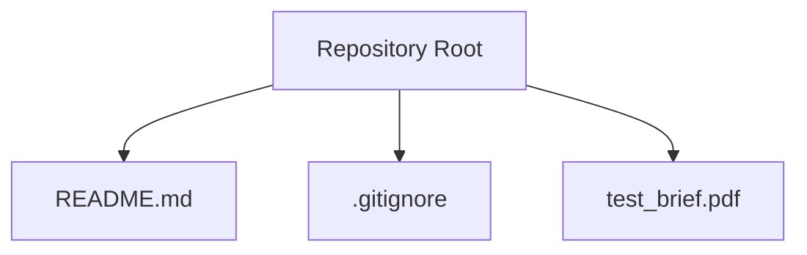
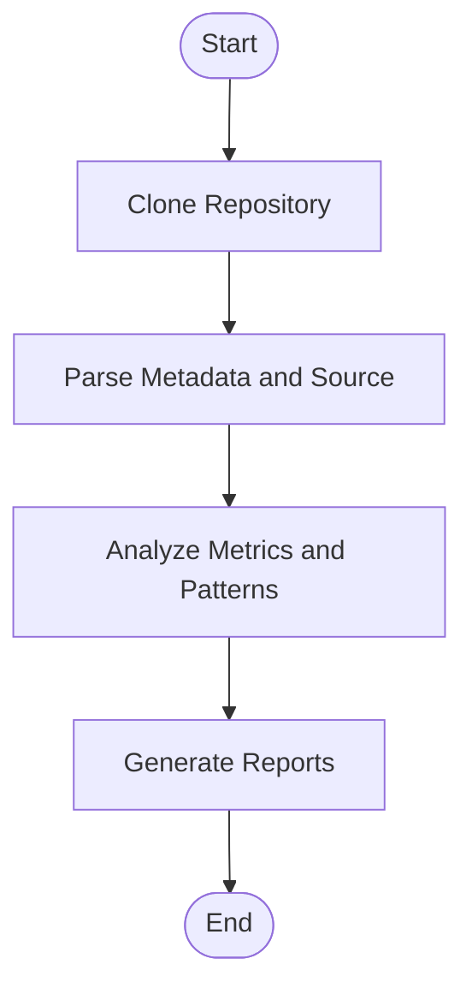

# Getting Started

<cite>
**Referenced Files in This Document**
- [README.md](file://README.md)
- [.gitignore](file://.gitignore)
</cite>

## Table of Contents
1. [Introduction](#introduction)
2. [Project Structure](#project-structure)
3. [Prerequisites](#prerequisites)
4. [Initial Setup](#initial-setup)
5. [Environment Configuration](#environment-configuration)
6. [First Steps](#first-steps)
7. [Making Your First Contribution](#making-your-first-contribution)
8. [Troubleshooting Guide](#troubleshooting-guide)
9. [Conceptual Overview](#conceptual-overview)
10. [Conclusion](#conclusion)

## Introduction
This guide helps you get started with the Repo-Analysis-Tool project. It covers prerequisites, initial setup, environment configuration, and your first steps for contributing or extending the tool. The repository is currently a minimal starter structure; as implementation files are added, this guide will evolve to include concrete commands and examples.

**Section sources**
- [README.md:1-3](file://README.md#L1-L3)

## Project Structure
At present, the repository contains:
- A README file describing the project title and context
- A .gitignore file that excludes common development artifacts (logs, caches, dependency directories, build outputs, etc.)
- A PDF brief included in the repository root

**Diagram sources**
- [README.md:1-3](file://README.md#L1-L3)
- [.gitignore:1-150](file://.gitignore#L1-L150)

**Section sources**
- [README.md:1-3](file://README.md#L1-L3)
- [.gitignore:1-150](file://.gitignore#L1-L150)

## Prerequisites
Before starting, ensure you have the following knowledge and tools:
- Node.js ecosystem familiarity: package managers (npm/yarn/pnpm), scripts, and typical project conventions
- Git version control: cloning repositories, branching, committing, pushing, and creating pull requests
- Software development processes: issue tracking, code reviews, testing, and continuous integration concepts

These skills will help you navigate the repository, set up dependencies once they are introduced, and collaborate effectively.

[No sources needed since this section provides general guidance]

## Initial Setup
Follow these steps to prepare your local environment:

1. Install Node.js and a package manager
   - Use an LTS release of Node.js
   - Choose npm, yarn, or pnpm based on team preference

2. Clone the repository
   - Clone the repository to your local machine using your preferred Git client or CLI

3. Inspect the repository
   - Review README.md for project context
   - Review .gitignore to understand which files should not be committed

4. Prepare your editor
   - Configure your editor to ignore generated files listed in .gitignore
   - Enable linting and formatting rules once project configurations are added

[No sources needed since this section provides general guidance]

## Environment Configuration
The repository includes a comprehensive .gitignore that excludes:
- Logs and diagnostic reports
- Dependency directories (e.g., node_modules)
- Build outputs and caches (e.g., dist, .next, .nuxt, .cache)
- Package manager-specific files (e.g., .yarn, .pnpm-store)
- Environment variable files (.env, .env.*) while allowing .env.example

When the project adds runtime configuration, follow these patterns:
- Create a .env file locally for secrets and overrides
- Copy .env.example if provided to seed required variables
- Avoid committing sensitive data; rely on CI/CD secret management

**Section sources**
- [.gitignore:1-150](file://.gitignore#L1-L150)

## First Steps
Once your environment is ready:
- Explore the repository structure and read README.md for context
- If a test brief or requirements document exists (e.g., test_brief.pdf), review it to understand goals and scope
- Identify any existing scripts or entry points when they are added (e.g., package.json scripts)
- Start by opening issues or tasks related to documentation, tests, or small enhancements

[No sources needed since this section provides general guidance]

## Making Your First Contribution
A typical contribution workflow:
1. Create a feature branch from main
2. Implement changes following project conventions (once defined)
3. Add or update tests and documentation as needed
4. Run linters and formatters (when configured)
5. Commit with clear messages and push your branch
6. Open a pull request and address review feedback

As the project evolves, add concrete commands for building, testing, and running the tool here.

[No sources needed since this section provides general guidance]

## Troubleshooting Guide
Common setup issues and resolutions:
- Missing Node.js or incorrect version
  - Ensure Node.js LTS is installed and active in your shell
  - Verify with your package manager’s version check command
- Permission errors during installation
  - Avoid using sudo with package managers; fix ownership or use a user-level install path
- Conflicts with global packages
  - Prefer local installations within the project directory
- Accidentally committing large files or secrets
  - Confirm .gitignore patterns are respected; remove unintended files from history if necessary
- Editor shows many ignored files
  - Refresh your editor’s workspace and ensure it respects .gitignore

If you encounter issues specific to later stages (e.g., missing scripts or configs), revisit this section after those files are added.

[No sources needed since this section provides general guidance]

## Conceptual Overview
Repo analysis typically involves:
- Cloning repositories and parsing metadata (commits, authors, branches)
- Extracting source code and generating metrics (size, complexity, coverage)
- Detecting patterns such as license presence, dependency usage, and code quality signals
- Producing reports and dashboards for stakeholders

As the Repo-Analysis-Tool grows, this section will link to concrete modules and workflows implemented in the codebase.

[No sources needed since this diagram shows conceptual workflow, not actual code structure]

## Conclusion
You now have the foundational steps to set up your environment, explore the repository, and begin contributing. As the project matures, additional sections will provide concrete commands, configuration details, and architecture diagrams tied to the implementation.

[No sources needed since this section summarizes without analyzing specific files]