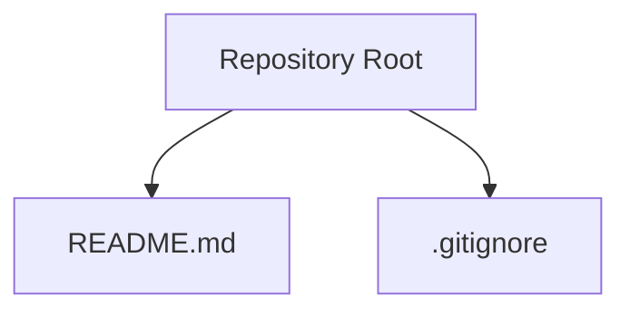
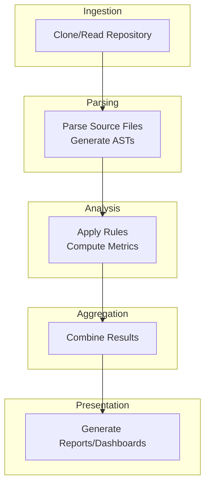

# Project Overview

<cite>
**Referenced Files in This Document**
- [README.md](file://README.md)
</cite>

## Table of Contents
1. [Introduction](#introduction)
2. [Project Structure](#project-structure)
3. [Core Components](#core-components)
4. [Architecture Overview](#architecture-overview)
5. [Detailed Component Analysis](#detailed-component-analysis)
6. [Dependency Analysis](#dependency-analysis)
7. [Performance Considerations](#performance-considerations)
8. [Troubleshooting Guide](#troubleshooting-guide)
9. [Conclusion](#conclusion)

## Introduction
This document provides a comprehensive overview of the Repo-Analysis-Tool project, an SDP Test 2026 initiative. The repository currently serves as a foundation for a repository analysis tool, with its primary purpose and scope outlined in the project’s README. At this stage, the codebase is minimal, indicating that the project is in early development and focused on establishing structure and intent rather than delivering full functionality.

The project name suggests capabilities commonly associated with repository analysis tools: inspecting source code repositories to extract metadata, analyze code quality, detect dependencies, and generate insights for developers and maintainers. While these features are not implemented yet, they represent the expected direction and value proposition of the tool within the broader ecosystem of developer productivity and software engineering workflows.

## Project Structure
At present, the repository contains only two items:
- A README file describing the project and its association with SDP Test 2026
- A .gitignore file (not analyzed here)

**Diagram sources**
- [README.md:1-3](file://README.md#L1-L3)

**Section sources**
- [README.md:1-3](file://README.md#L1-L3)

## Core Components
Given the current state of the repository, there are no executable components or libraries to analyze. The core “component” at this time is the project’s stated purpose and context:
- Purpose: Establish a foundation for a repository analysis tool under the SDP Test 2026 initiative
- Scope: Not yet implemented; future work will likely include parsing repositories, extracting metrics, and generating reports

Conceptually, a repository analysis tool typically includes:
- Repository ingestion (cloning or reading local repos)
- Code parsing and AST generation
- Metrics collection (e.g., complexity, duplication, coverage)
- Dependency mapping
- Reporting and visualization

These concepts guide the future design and architecture of the tool but are not present in the current codebase.

[No sources needed since this section describes conceptual components without analyzing specific files]

## Architecture Overview
While no implementation exists yet, the intended architecture for a repository analysis tool generally follows a layered approach:
- Ingestion Layer: Reads or clones repositories
- Parsing Layer: Converts source code into structured representations (ASTs)
- Analysis Layer: Applies rules and computes metrics
- Aggregation Layer: Combines results across files and modules
- Presentation Layer: Generates reports, dashboards, or APIs

[No sources needed since this diagram shows conceptual workflow, not actual code structure]

## Detailed Component Analysis
There are no code components to analyze in this repository at this time. Future development should consider modularizing responsibilities such as:
- CLI interface for user interaction
- Repository scanner for traversal and filtering
- Parser adapters for different languages
- Rule engine for customizable analysis
- Report generator for output formats (JSON, HTML, PDF)

Until implementation begins, this section remains conceptual and does not reference specific files.

[No sources needed since this section doesn't analyze specific source files]

## Dependency Analysis
No external dependencies are declared in the current repository. As development progresses, dependencies may be introduced for:
- Language-specific parsers (e.g., tree-sitter, language SDKs)
- Metric computation libraries
- Reporting frameworks
- Testing utilities

For now, the project has no runtime or build-time dependencies visible in the provided files.

[No sources needed since this section provides general guidance]

## Performance Considerations
Future implementations should account for:
- Efficient repository scanning (incremental updates, parallel processing)
- Memory management when handling large codebases
- Caching strategies for parsed ASTs and computed metrics
- Scalable reporting for multi-repository analyses

These considerations are architectural guidelines and do not apply to the current minimal codebase.

[No sources needed since this section provides general guidance]

## Troubleshooting Guide
As there is no functional code yet, troubleshooting is not applicable. When implementation begins, common issues may include:
- Repository access permissions
- Unsupported file types or languages
- Large repository performance bottlenecks
- Misconfigured analysis rules

A future troubleshooting guide should address these scenarios with actionable steps.

[No sources needed since this section provides general guidance]

## Conclusion
Repo-Analysis-Tool is an SDP Test 2026 initiative positioned as a foundation for a repository analysis tool. The repository currently contains only a README declaring its purpose and test affiliation. The project’s goals point toward building a tool that can analyze code repositories to provide insights valuable to developers and teams. While no implementation exists yet, the conceptual framework aligns with standard practices in repository analysis, including ingestion, parsing, analysis, aggregation, and reporting. Future development should focus on defining concrete requirements, selecting appropriate technologies, and implementing modular components that adhere to best practices in scalability, maintainability, and usability.

[No sources needed since this section summarizes without analyzing specific files]