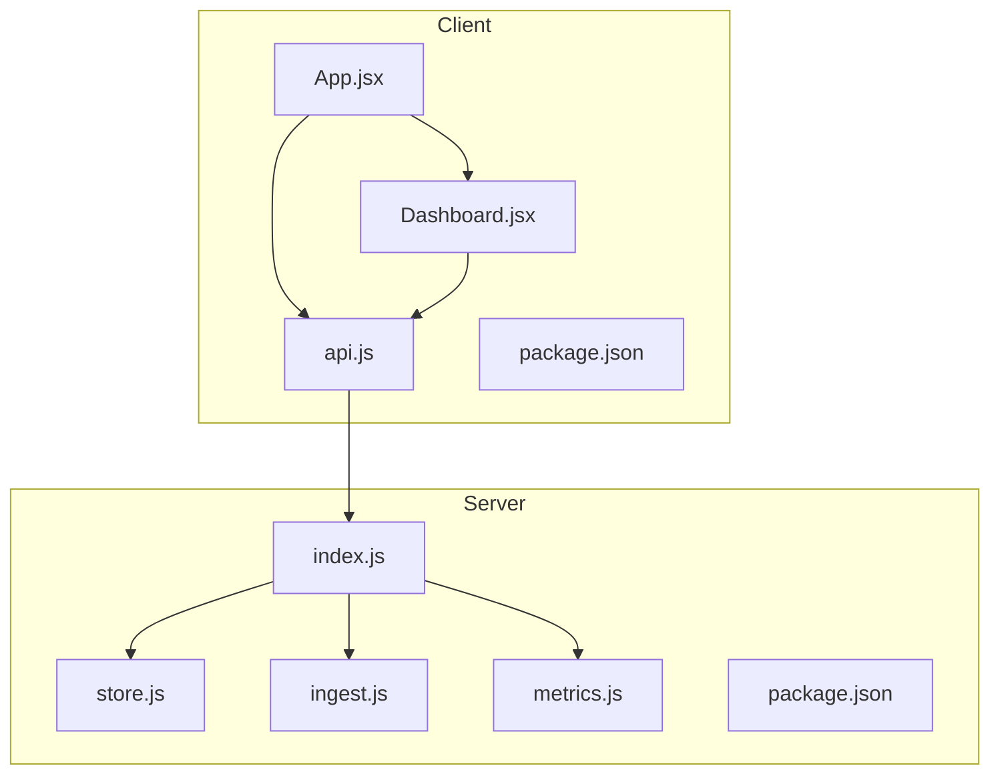
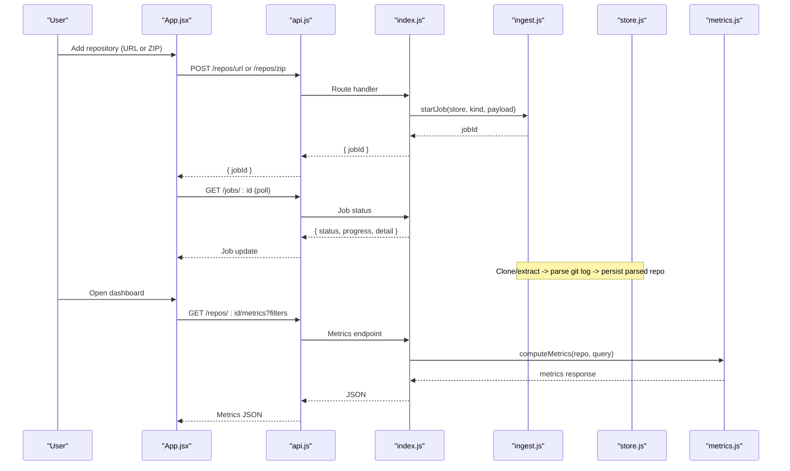
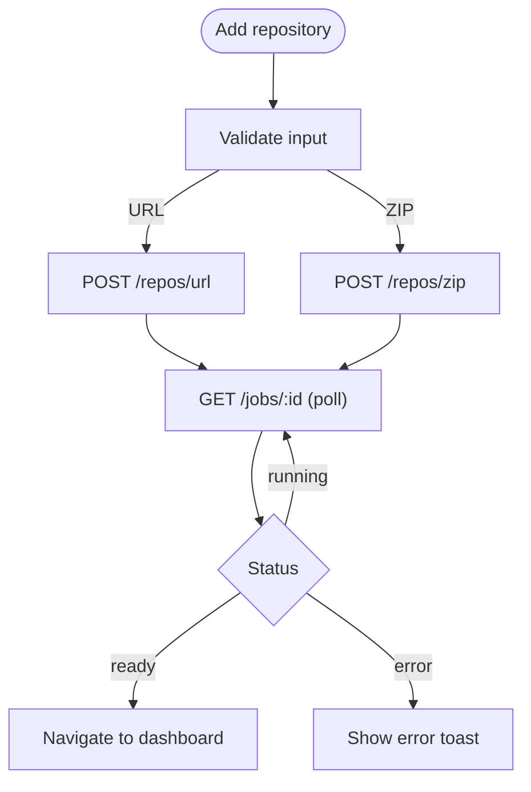
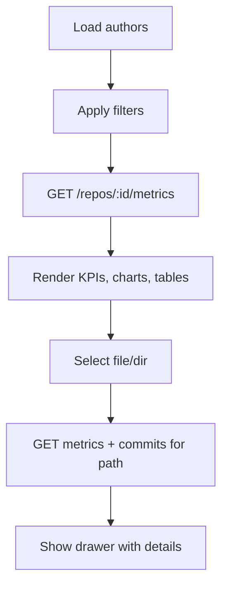
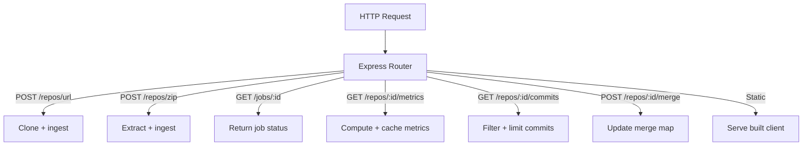
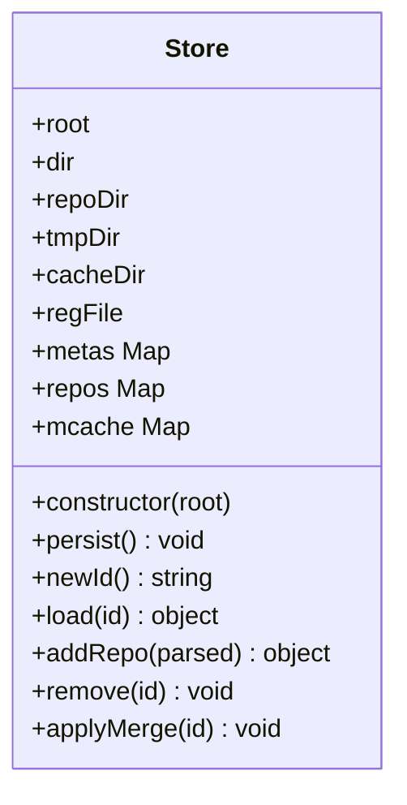
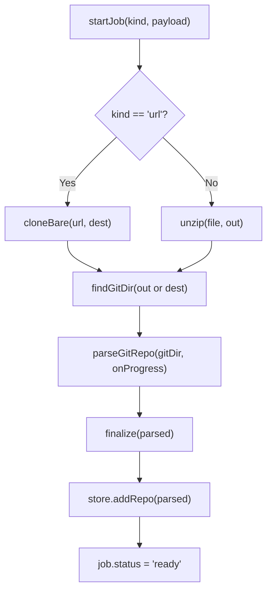
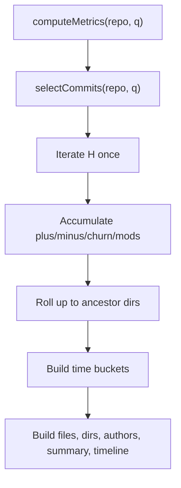
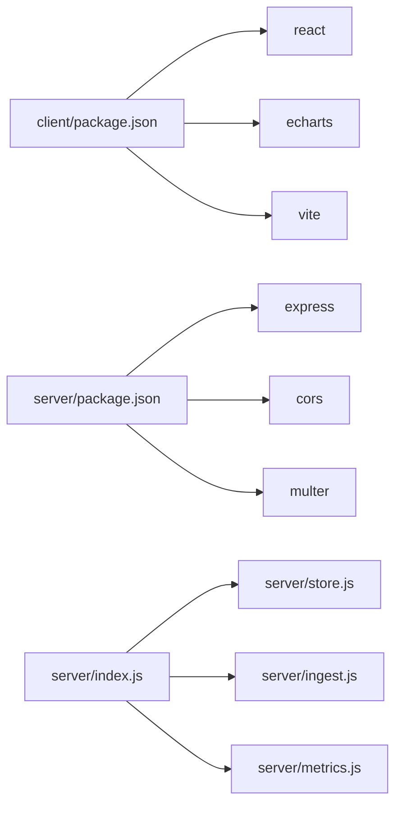

# Repo Analysis Tool Application

<cite>
**Referenced Files in This Document**
- [README.md](file://README.md)
- [client/src/App.jsx](file://client/src/App.jsx)
- [client/src/Dashboard.jsx](file://client/src/Dashboard.jsx)
- [client/src/api.js](file://client/src/api.js)
- [client/package.json](file://client/package.json)
- [server/index.js](file://server/index.js)
- [server/store.js](file://server/store.js)
- [server/ingest.js](file://server/ingest.js)
- [server/metrics.js](file://server/metrics.js)
- [server/package.json](file://server/package.json)
</cite>

## Table of Contents
1. [Introduction](#introduction)
2. [Project Structure](#project-structure)
3. [Core Components](#core-components)
4. [Architecture Overview](#architecture-overview)
5. [Detailed Component Analysis](#detailed-component-analysis)
6. [Dependency Analysis](#dependency-analysis)
7. [Performance Considerations](#performance-considerations)
8. [Troubleshooting Guide](#troubleshooting-guide)
9. [Conclusion](#conclusion)

## Introduction
Repo Analysis Tool (RAT) is a small full-stack application for ingesting Git repositories and computing code metrics over selected commit sets. The client is a React + Vite frontend that lets users clone repositories by URL or upload ZIP archives containing Git data. The server is an Express API that orchestrates ingestion, persists parsed repository metadata, computes metrics, and serves the built client.

The tool focuses on:
- Asynchronous ingestion jobs with progress polling
- Filtering commits by author, time range, path, or explicit commit hashes
- Computing per-file, per-directory, per-author, and timeline metrics
- Manual author identity merging on top of `.mailmap` normalization

**Section sources**
- [README.md:1-3](file://README.md#L1-L3)

## Project Structure
The project is split into two Node/npm packages:
- `client/`: React application using ECharts for visualizations
- `server/`: Express API with ingestion, persistence, and metric computation

**Diagram sources**
- [client/src/App.jsx:1-5](file://client/src/App.jsx#L1-L5)
- [client/src/Dashboard.jsx:1-5](file://client/src/Dashboard.jsx#L1-L5)
- [client/src/api.js:1-73](file://client/src/api.js#L1-L73)
- [server/index.js:16-24](file://server/index.js#L16-L24)
- [server/store.js:14-31](file://server/store.js#L14-L31)
- [server/ingest.js:14-21](file://server/ingest.js#L14-L21)
- [server/metrics.js:18-20](file://server/metrics.js#L18-L20)

**Section sources**
- [client/package.json:1-21](file://client/package.json#L1-L21)
- [server/package.json:1-16](file://server/package.json#L1-L16)

## Core Components
- Client entry and routing: `App.jsx` manages repository list, job polling, add/remove flows, and switches between repository list and dashboard views.
- Dashboard: `Dashboard.jsx` provides filters, charts, file/directory drill-down, author merge UI, and commit verification helpers.
- HTTP client wrapper: `api.js` centralizes fetch calls to `/api/*`.
- Server API: `index.js` defines REST endpoints, uploads, job orchestration, metrics, and static serving.
- Persistence: `store.js` maintains registry, parsed repo cache, and metrics cache.
- Ingestion: `ingest.js` clones or extracts repos, runs one `git log` pass, and produces compact parsed structures.
- Metrics engine: `metrics.js` computes summary, files, directories, authors, timeline, and object-level breakdowns.

**Section sources**
- [client/src/App.jsx:8-117](file://client/src/App.jsx#L8-L117)
- [client/src/Dashboard.jsx:82-177](file://client/src/Dashboard.jsx#L82-L177)
- [client/src/api.js:17-72](file://client/src/api.js#L17-L72)
- [server/index.js:16-24](file://server/index.js#L16-L24)
- [server/store.js:18-38](file://server/store.js#L18-L38)
- [server/ingest.js:228-299](file://server/ingest.js#L228-L299)
- [server/metrics.js:49-253](file://server/metrics.js#L49-L253)

## Architecture Overview
RAT follows a client-server architecture with asynchronous background jobs:

**Diagram sources**
- [client/src/App.jsx:70-117](file://client/src/App.jsx#L70-L117)
- [client/src/api.js:17-72](file://client/src/api.js#L17-L72)
- [server/index.js:85-112](file://server/index.js#L85-L112)
- [server/index.js:155-167](file://server/index.js#L155-L167)
- [server/ingest.js:228-299](file://server/ingest.js#L228-L299)
- [server/metrics.js:49-253](file://server/metrics.js#L49-L253)

## Detailed Component Analysis

### Client: App.jsx
Responsibilities:
- Repository list management and view switching
- Adding repositories by URL or ZIP upload
- Background job polling until ready or error
- Toast notifications and basic state coordination

Key behaviors:
- Initial load of repositories via `api.listRepos()`
- `addByUrl` and `uploadZip` trigger ingestion jobs and start polling
- `watchJob` polls `/api/jobs/:id`, updates progress, and navigates to dashboard when ready
- Remove repository triggers deletion and refreshes list

**Diagram sources**
- [client/src/App.jsx:70-117](file://client/src/App.jsx#L70-L117)

**Section sources**
- [client/src/App.jsx:8-117](file://client/src/App.jsx#L8-L117)

### Client: Dashboard.jsx
Responsibilities:
- Author selection, date range, path filter, manual commit list
- Fetching and displaying metrics, timelines, treemaps, and tables
- File/directory drill-down drawer with per-object metrics and commit history
- Merge authors modal and commit verifier panel

Key behaviors:
- Loads authors via `api.authors(repoId)`
- Applies filters and loads metrics via `api.metrics(repoId, params)`
- Opens file details by fetching both metrics and commits for the selected path
- Provides merge/unmerge flows through `api.merge` and `api.unmerge`

**Diagram sources**
- [client/src/Dashboard.jsx:96-177](file://client/src/Dashboard.jsx#L96-L177)

**Section sources**
- [client/src/Dashboard.jsx:82-177](file://client/src/Dashboard.jsx#L82-L177)

### Client: api.js
Responsibilities:
- Centralized fetch wrappers for all server endpoints
- Error handling that surfaces server error messages
- Query parameter serialization for metrics and commits

Endpoints used:
- `GET /api/repos`
- `POST /api/repos/url`
- `POST /api/repos/zip`
- `GET /api/jobs/:id`
- `DELETE /api/repos/:id`
- `GET /api/repos/:id/metrics`
- `GET /api/repos/:id/commits`
- `GET /api/repos/:id/authors`
- `POST /api/repos/:id/merge`
- `POST /api/repos/:id/unmerge`

**Section sources**
- [client/src/api.js:1-73](file://client/src/api.js#L1-L73)

### Server: index.js
Responsibilities:
- Express app setup with CORS, JSON parsing, and file upload limits
- Job lifecycle endpoints (`/api/repos/url`, `/api/repos/zip`, `/api/jobs/:id`)
- Registry endpoints (`/api/repos`, `/api/repos/:id`, DELETE)
- Author listing and merge/unmerge endpoints
- Metrics and commit drill-down endpoints with filtering
- Static client serving in production builds

Important implementation notes:
- Upload directory created under store’s temp directory
- Filters are normalized and sanitized before use
- Metrics results are cached in memory keyed by repo ID and query string
- Health check endpoint at `/api/health`

**Diagram sources**
- [server/index.js:30-38](file://server/index.js#L30-L38)
- [server/index.js:85-112](file://server/index.js#L85-L112)
- [server/index.js:155-191](file://server/index.js#L155-L191)
- [server/index.js:193-221](file://server/index.js#L193-L221)
- [server/index.js:223-231](file://server/index.js#L223-L231)

**Section sources**
- [server/index.js:16-243](file://server/index.js#L16-L243)

### Server: store.js
Responsibilities:
- Manage registry of repositories and their metadata
- Persist parsed repository JSON to disk
- Provide in-memory caches for loaded repos and metrics
- Handle removal and merge application without rewriting large cache files

Data model highlights:
- Registry file stores minimal metadata; parsed repo data stored separately
- Manual merges and display name overrides live in registry meta and are applied at query time
- Metrics cache key includes repo ID and serialized query parameters

**Diagram sources**
- [server/store.js:18-108](file://server/store.js#L18-L108)

**Section sources**
- [server/store.js:1-109](file://server/store.js#L1-L109)

### Server: ingest.js
Responsibilities:
- Orchestrate cloning from URLs or extracting ZIP archives
- Run a single `git log` invocation to parse commit history efficiently
- Normalize paths, detect renames, build directory structure, and aggregate author identities
- Update job status and progress throughout the pipeline

Pipeline stages:
- Clone bare repository or unzip archive
- Locate Git directory (supports `.git` folder, pointer file, or bare repo)
- Parse commit history with rename detection and numstat
- Finalize directory ancestors and base authors
- Persist parsed repo and mark job ready

**Diagram sources**
- [server/ingest.js:228-299](file://server/ingest.js#L228-L299)
- [server/ingest.js:168-194](file://server/ingest.js#L168-L194)
- [server/ingest.js:48-120](file://server/ingest.js#L48-L120)

**Section sources**
- [server/ingest.js:1-301](file://server/ingest.js#L1-L301)

### Server: metrics.js
Responsibilities:
- Compute repository-wide and scoped metrics over a selected commit set H
- Aggregate per-file, per-directory, per-author, and timeline statistics
- Support filters: authors, time range, path, explicit commit hashes
- Cap output sizes for performance and usability

Algorithm overview:
- Select commits based on filters
- Iterate commits once, accumulating churn and modification counts
- Roll up file changes to ancestor directories
- Build timeline buckets based on commit span
- Produce summaries, top lists, and optional object-level author breakdowns

**Diagram sources**
- [server/metrics.js:49-253](file://server/metrics.js#L49-L253)

**Section sources**
- [server/metrics.js:1-255](file://server/metrics.js#L1-L255)

## Dependency Analysis
High-level dependencies:
- Client depends on React, ECharts, and Vite
- Server depends on Express, CORS, and Multer
- Server modules depend on each other: index imports store, ingest, and metrics

**Diagram sources**
- [client/package.json:11-18](file://client/package.json#L11-L18)
- [server/package.json:10-14](file://server/package.json#L10-L14)
- [server/index.js:16-24](file://server/index.js#L16-L24)

**Section sources**
- [client/package.json:1-21](file://client/package.json#L1-L21)
- [server/package.json:1-16](file://server/package.json#L1-L16)
- [server/index.js:16-24](file://server/index.js#L16-L24)

## Performance Considerations
- Ingestion uses a single streaming `git log` pass to minimize I/O and CPU overhead
- Path interning and ancestor precomputation reduce repeated string operations during metric aggregation
- Metrics computation performs a single pass over selected commits, with capped result sizes for files, directories, and authors
- Memory caching for parsed repos and metrics reduces repeated disk reads and recomputation
- Upload size limits are high to accommodate large repository archives, but clients should be mindful of network constraints

[No sources needed since this section provides general guidance]

## Troubleshooting Guide
Common issues and resolutions:
- Job errors: Check job status via `/api/jobs/:id`; ingestion failures set `status: 'error'` with a message
- Invalid repository source: Ensure URL scheme is supported or ZIP contains a valid Git repository structure
- Missing metrics: Verify filters are correct; empty commit sets produce zeroed metrics
- Merge not reflected: After applying merges, metrics cache is cleared; re-fetch metrics to see updated author aggregation
- Client fetch errors: The client wrapper throws with server-provided error messages; inspect network responses for details

Operational tips:
- Use `/api/health` to verify server availability
- Clear metrics cache implicitly by removing or re-ingesting repositories
- Monitor job progress polling interval and handle transient poll errors gracefully

**Section sources**
- [server/index.js:40-49](file://server/index.js#L40-L49)
- [server/index.js:85-112](file://server/index.js#L85-L112)
- [server/index.js:155-167](file://server/index.js#L155-L167)
- [server/ingest.js:291-296](file://server/ingest.js#L291-L296)
- [client/src/api.js:3-15](file://client/src/api.js#L3-L15)

## Conclusion
Repo Analysis Tool provides a focused workflow for ingesting Git repositories and analyzing code change patterns across time, authors, and paths. Its design emphasizes efficient ingestion, clear separation of concerns, and a responsive client experience. By leveraging asynchronous jobs, single-pass parsing, and cached metrics, RAT scales well for typical development workflows while remaining simple to operate and extend.

[No sources needed since this section summarizes without analyzing specific files]