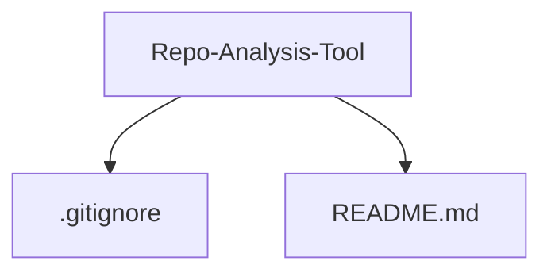
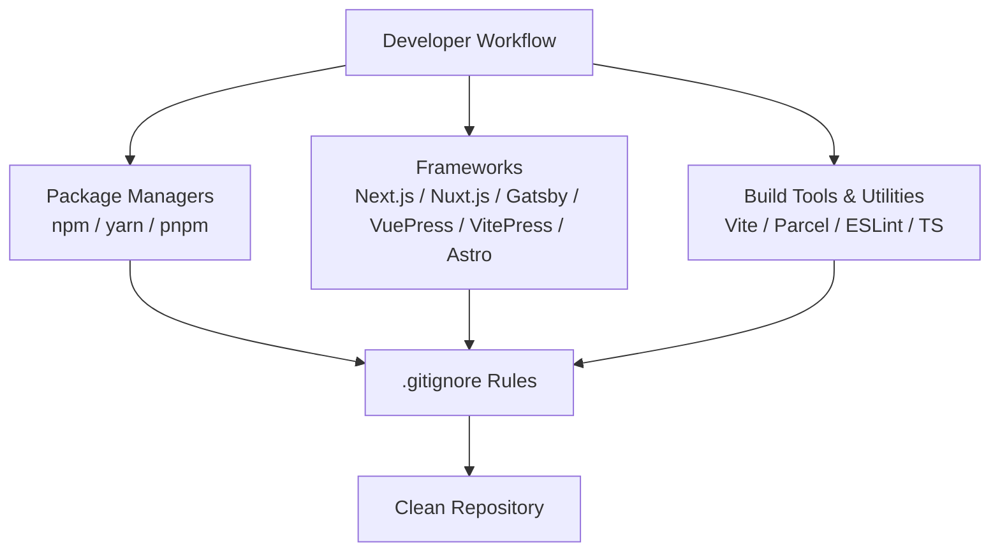
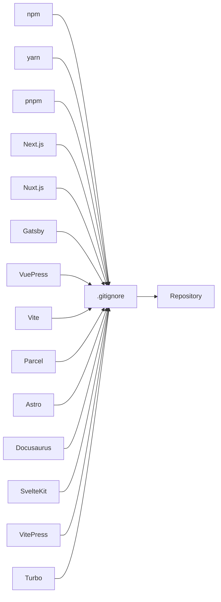

# Project Setup Guide

<cite>
**Referenced Files in This Document**
- [.gitignore](file://.gitignore)
- [README.md](file://README.md)
</cite>

## Table of Contents
1. [Introduction](#introduction)
2. [Project Structure](#project-structure)
3. [Core Components](#core-components)
4. [Architecture Overview](#architecture-overview)
5. [Detailed Component Analysis](#detailed-component-analysis)
6. [Dependency Analysis](#dependency-analysis)
7. [Performance Considerations](#performance-considerations)
8. [Troubleshooting Guide](#troubleshooting-guide)
9. [Conclusion](#conclusion)

## Introduction
This guide explains how to set up and maintain a clean Node.js repository using the provided .gitignore configuration for Repo-Analysis-Tool. It covers why each ignore pattern exists, how it supports modern JavaScript development workflows (npm, yarn, pnpm, Next.js, Nuxt.js, Gatsby, VuePress, Vite, Parcel, and more), and how to customize the setup for your project’s needs. The goal is to keep your repository focused on source code while excluding generated artifacts, caches, and sensitive files.

## Project Structure
The repository currently includes:
- A comprehensive .gitignore tailored for Node.js and popular frameworks/build tools
- A minimal README describing the project name

**Diagram sources**
- [.gitignore:1-150](file://.gitignore#L1-L150)
- [README.md:1-3](file://README.md#L1-L3)

**Section sources**
- [.gitignore:1-150](file://.gitignore#L1-L150)
- [README.md:1-3](file://README.md#L1-L3)

## Core Components
The core component driving this setup is the .gitignore file. It defines what should not be committed to version control. It is organized into logical sections that cover:
- Logs and diagnostics
- Runtime data and process files
- Coverage and instrumentation outputs
- Dependency directories and package manager caches
- Framework-specific build outputs and caches
- Tooling and editor-related temporary files
- Environment variables and secrets

Key categories include:
- Package managers: npm, yarn (including v3), pnpm
- Frameworks: Next.js, Nuxt.js, Gatsby, VuePress, SvelteKit, VitePress, Docusaurus, Astro
- Build tools: Vite, Parcel, FuseBox, Snowpack
- Dev utilities: ESLint, Stylelint, TypeScript cache, REPL history
- Local services and tooling: DynamoDB Local, Firebase, VS Code test runner

**Section sources**
- [.gitignore:1-150](file://.gitignore#L1-L150)

## Architecture Overview
The .gitignore acts as a centralized policy layer that coordinates exclusion rules across the entire Node.js ecosystem. It ensures consistent behavior regardless of which package manager or framework you use.

[No sources needed since this diagram shows conceptual workflow, not actual code structure]

## Detailed Component Analysis

### Logging and Diagnostics
- Excludes log files and diagnostic reports to prevent noisy commits and protect runtime information.

Rationale:
- Logs can contain sensitive data and change frequently.
- Diagnostic reports are large and environment-specific.

**Section sources**
- [.gitignore:1-10](file://.gitignore#L1-L10)

### Runtime Data and Process Files
- Ignores PID files, seeds, and lock files used by running processes.

Rationale:
- These files are ephemeral and tied to local environments.

**Section sources**
- [.gitignore:12-16](file://.gitignore#L12-L16)

### Coverage and Instrumentation
- Excludes coverage directories and instrumented libraries.

Rationale:
- Coverage outputs are large, generated per run, and vary by environment.

**Section sources**
- [.gitignore:18-26](file://.gitignore#L18-L26)

### Dependency Directories and Caches
- Excludes dependency folders and caches from various package managers and bundlers.

Rationale:
- Dependencies are reproducible via lockfiles; caching improves performance but should not be committed.

Patterns covered:
- node_modules, jspm_packages, web_modules
- .npm, .pnpm-store
- .yarn/* with selective inclusions for patches, plugins, releases, sdks, versions

**Section sources**
- [.gitignore:40-45](file://.gitignore#L40-L45)
- [.gitignore:50-57](file://.gitignore#L50-L57)
- [.gitignore:65-66](file://.gitignore#L65-L66)
- [.gitignore:128-138](file://.gitignore#L128-L138)

### Framework-Specific Outputs and Caches
- Excludes build outputs and caches for major frameworks and static site generators.

Rationale:
- Generated artifacts are deterministic and should be rebuilt locally.

Frameworks covered:
- Next.js (.next, out)
- Nuxt.js (.nuxt, dist, .output)
- Gatsby (.cache)
- VuePress (.vuepress/dist, .temp)
- SvelteKit (.svelte-kit)
- VitePress (**/.vitepress/dist, **/.vitepress/cache)
- Docusaurus (.docusaurus)
- Astro (.astro)

**Section sources**
- [.gitignore:77-109](file://.gitignore#L77-L109)

### Build Tools and Bundlers
- Excludes caches and intermediate files from build tools.

Rationale:
- Caches speed up builds but are platform-specific and should not be shared.

Tools covered:
- Vite (vite.config.*.timestamp-*, .vite/)
- Parcel (.cache, .parcel-cache)
- FuseBox (.fusebox)
- Snowpack (web_modules)

**Section sources**
- [.gitignore:73-75](file://.gitignore#L73-L75)
- [.gitignore:140-143](file://.gitignore#L140-L143)
- [.gitignore:113-114](file://.gitignore#L113-L114)
- [.gitignore:44-45](file://.gitignore#L44-L45)

### Development Utilities and Editor Artifacts
- Excludes caches and temporary files from linters, TypeScript, REPL, and editors.

Rationale:
- These files improve developer experience but are not part of the source.

Utilities covered:
- ESLint (.eslintcache)
- Stylelint (.stylelintcache)
- TypeScript (*.tsbuildinfo)
- Node REPL (.node_repl_history)
- VS Code test runner (.vscode-test)

**Section sources**
- [.gitignore:47-60](file://.gitignore#L47-L60)
- [.gitignore:125-126](file://.gitignore#L125-L126)

### Environment Variables and Secrets
- Excludes environment variable files except an example template.

Rationale:
- Prevents accidental commit of secrets while allowing documentation of required variables.

Pattern highlights:
- Ignore .env and .env.*
- Allowlist .env.example

**Section sources**
- [.gitignore:68-71](file://.gitignore#L68-L71)

### Local Services and Tooling
- Excludes local service data and tooling state.

Rationale:
- Local-only data should not be shared across environments.

Services covered:
- DynamoDB Local (.dynamodb)
- Firebase (.firebase)
- TernJS (.tern-port)

**Section sources**
- [.gitignore:116-123](file://.gitignore#L116-L123)

### Monorepos and Task Runners
- Excludes monorepo orchestration artifacts.

Rationale:
- Task runners generate caches and metadata that are environment-specific.

Tool covered:
- Turbo (.turbo)

**Section sources**
- [.gitignore:148-150](file://.gitignore#L148-L150)

### Customization Guidance
To tailor the .gitignore for your project:
- Add new patterns under the relevant section comment for clarity.
- Use negation (!pattern) to allowlist specific files or directories when necessary.
- Prefer directory-level ignores for generated outputs (e.g., build/, dist/).
- Keep environment variables safe by ignoring .env files and documenting required keys in .env.example.
- Review dependencies: if you switch package managers, ensure the corresponding cache directories are ignored.

Best practices:
- Commit only source code, configuration, and essential assets.
- Avoid committing large binary artifacts unless required; consider external storage.
- Keep lockfiles committed to ensure reproducible installs.
- Regularly audit .gitignore to remove obsolete patterns and add new ones as tools evolve.

[No sources needed since this section provides general guidance]

## Dependency Analysis
The .gitignore centralizes exclusion policies across multiple ecosystems. This reduces duplication and prevents accidental inclusion of environment-specific files.

**Diagram sources**
- [.gitignore:40-45](file://.gitignore#L40-L45)
- [.gitignore:65-66](file://.gitignore#L65-L66)
- [.gitignore:128-138](file://.gitignore#L128-L138)
- [.gitignore:77-109](file://.gitignore#L77-L109)
- [.gitignore:140-143](file://.gitignore#L140-L143)
- [.gitignore:148-150](file://.gitignore#L148-L150)

**Section sources**
- [.gitignore:40-45](file://.gitignore#L40-L45)
- [.gitignore:65-66](file://.gitignore#L65-L66)
- [.gitignore:77-109](file://.gitignore#L77-L109)
- [.gitignore:128-138](file://.gitignore#L128-L138)
- [.gitignore:140-143](file://.gitignore#L140-L143)
- [.gitignore:148-150](file://.gitignore#L148-L150)

## Performance Considerations
- Keeping caches and build outputs out of version control reduces repository size and speeds up cloning and CI operations.
- Using lockfiles ensures deterministic dependency resolution without committing heavy dependency trees.
- Ignoring large generated artifacts avoids unnecessary diffs and merge conflicts.

[No sources needed since this section provides general guidance]

## Troubleshooting Guide
Common issues and resolutions:
- Accidentally committed sensitive files:
  - Remove them from history and enforce .env exclusions.
  - Rotate any exposed secrets immediately.
- Large repository due to cached outputs:
  - Ensure all cache directories (e.g., .next, .nuxt, .vitepress, .parcel-cache) are ignored.
- Conflicts between package managers:
  - Verify that npm, yarn, and pnpm caches are ignored if you switch managers.
- Missing allowed exceptions:
  - If a tool requires certain files to be tracked, add explicit !negations (e.g., allowlist patches or plugins).

**Section sources**
- [.gitignore:68-71](file://.gitignore#L68-L71)
- [.gitignore:73-75](file://.gitignore#L73-L75)
- [.gitignore:128-138](file://.gitignore#L128-L138)

## Conclusion
The provided .gitignore establishes a robust baseline for Node.js projects, covering package managers, frameworks, build tools, and development utilities. By following the customization guidance and best practices outlined here, you can maintain a clean, secure, and efficient repository that scales with your team and technology stack.

[No sources needed since this section summarizes without analyzing specific files]